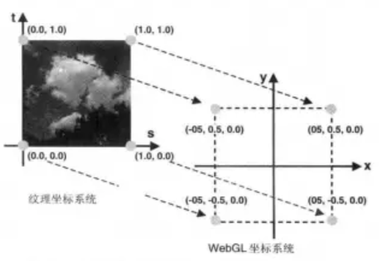

# webgl基础概念
WebGL仅仅是一个光栅化引擎，它可以根据你的代码绘制出点，线和三角形。 想要利用WebGL完成更复杂任务，取决于你能否提供合适的代码，组合使用点，线和三角形代替实现。
webgl代码需要提供成对的方法。每对方法中一个叫顶点着色器， 另一个叫片元着色器，并且使用一种和C或C++类似的强类型的语言 GLSL。 每一对组合起来称作一个 program（着色程序）。
顶点着色器的作用是计算顶点的位置。根据计算出的一系列顶点位置，WebGL可以对点， 线和三角形在内的一些图元进行光栅化处理。当对这些图元进行光栅化处理时需要使用片元着色器方法。 片元着色器的作用是计算出当前绘制图元中每个像素的颜色值。
WebGL只关心两件事：裁剪空间中的坐标值和颜色值。使用WebGL只需要给它提供这两个东西。 你需要提供两个着色器来做这两件事，一个顶点着色器提供裁剪空间坐标值，一个片元着色器提供颜色值。

# webgl工作原理

[透视矩阵展示](https://webglfundamentals.org/webgl/frustum-diagram.html)

# webgl纹理
对一个几何图形进行贴图，所贴的图就叫纹理(texture)，或纹理图像(texture image)
贴图的过程叫做纹理映射
组成纹理图像的像素称为 纹素(texels, texture elements)
光栅化时每个片元会涂上纹素
纹理和光照一样，都是作用于世界坐标系的，不受投影和视图矩阵的影响

纹理映射主要分为4步
1. 初始化纹理信息
需要设置纹理坐标，通过buffer绑定对应属性

```
textureCoord: gl.getAttribLocation(program, 'aTextureCoord') // 绑定属性

const textureCoordinates = [
  1.0,  1.0,
  0.0,  1.0,
  1.0,  0.0,
  0.0,  0.0,
  ......
];  // 设置纹理坐标

const textureBuffer = gl.createBuffer();

gl.bindBuffer(gl.ARRAY_BUFFER, textureBuffer);
gl.bufferData(gl.ARRAY_BUFFER,
    new Float32Array(textureCoordinates),
    gl.STATIC_DRAW
);  // 通过buffer绑定对应属性
```
2. 加载纹理图像
使用js加载对应的纹理图像，加载的图像不能对canvas造成污染，即需要遵循跨域策略
```
const image = new Image();
image.src = url;
image.onload = function() {
  ...
}
```
3. 配置并使用纹理
首先需要创建纹理对象，进行激活，随后将其绑定到gl.TEXTURE_2D上
```
const texture = gl.createTexture();
// 默认绑定到 0 号单元，如果只有一张纹理，无需进行 activeTexture
gl.activeTexture(gl.TEXTURE0);
gl.bindTexture(gl.TEXTURE_2D, texture); //创建并绑定纹理对象
```
使用gl.textImage2D方法指定二维图像
为了防止图片加载失败或者图片加载过慢，可以在图片加载完成之前放置单个色值，图片加载好后更新图片
```
//放置单个色值
const level = 0;  // 详细级别，0是基本图像等级
const internalFormat = gl.RGBA;  //指定纹理颜色组件
const width = 1;
const height = 1;
const border = 0;  // 必须为0
const srcFormat = gl.RGBA;  //指定数据格式 webgl1中必须与internalFormat相同
const srcType = gl.UNSIGNED_BYTE; // 即rgba 每个通道8位
const pixel = new Uint8Array([0, 0, 255, 255]);  // 不透明蓝色  纹理的像素源
gl.texImage2D(gl.TEXTURE_2D, level, internalFormat,  // 指定2维纹理图像
              width, height, border, srcFormat, srcType,
              pixel);

// 放置图片纹理
gl.texImage2D(gl.TEXTURE_2D, level, internalFormat,
                    srcFormat, srcType, image);
```
随后进行纹理环绕方式和纹理过滤的配置
前面说到纹理的坐标为0-1，如果设置的纹理坐标在0-1之外webgl会进行纹理的过滤，默认为重复纹理
需要注意的是，webgl对尺寸是否是2的幂的图像有着不同的支持，非2幂的图像支持程度较低，不能使用多级渐进纹理和纹理重复，需要做单独处理
```
if (isPowerOf2(image.width) && isPowerOf2(image.height)) {
    // 是 2 的幂，多级渐进纹理
    gl.generateMipmap(gl.TEXTURE_2D);
} else {
    // 不是 2 的幂，设置纹理坐标会被约束在0到1之间，超出的部分会重复纹理坐标的边缘
    gl.texParameteri(gl.TEXTURE_2D, gl.TEXTURE_WRAP_S, gl.CLAMP_TO_EDGE);
    gl.texParameteri(gl.TEXTURE_2D, gl.TEXTURE_WRAP_T, gl.CLAMP_TO_EDGE);
    gl.texParameteri(gl.TEXTURE_2D, gl.TEXTURE_MIN_FILTER, gl.LINEAR); // 线性过滤
}
```
4. 将纹理单元传递给着色器进行处理
```
uSampler: gl.getUniformLocation(program, 'uSampler'),

// 为取样器指定纹理单元(gl.TEXTUREn)编号
gl.uniform1i(programInfo.uniformLocations.uSampler, 0);
```